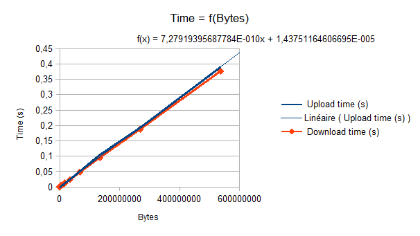
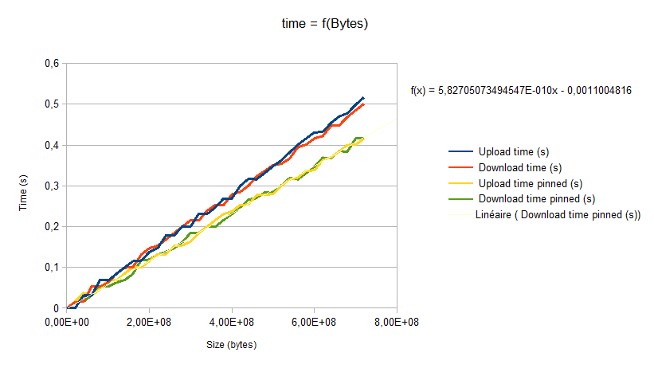
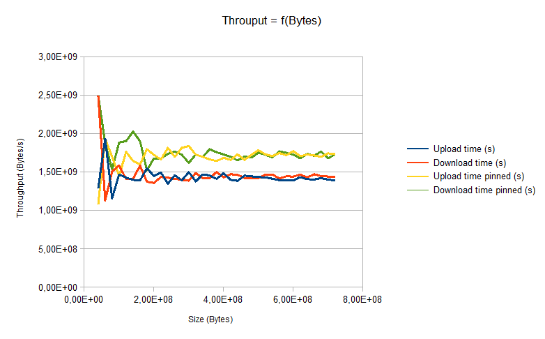

<!-- CUDA 16/05 -->

Docs :
* https://www.cs.virginia.edu/~mwb7w/cuda_support/memory_transfer_overhead.html : transfer CPU->GPU characteristics
* https://devblogs.nvidia.com/how-optimize-data-transfers-cuda-cc/

Parts :
* [Simple IO Test](#simple-io-test)
* [Advanced IO Test](#advanced-io-test)

## Simple IO test

* use of cudaMalloc and cudaMemcpy to test transfer from CPU to GPU
* getting slope t = 8.55e-10 s/bytes -> 1s correspond to  1,14 GB (linear increase)

* Little improvement : see function advanced_iotest
* comparing download/upload time -> seems to be the same
* Throughput = 1,424 GB/s

## Advanced IO test

### Pinned Host memory

* GPU cannot access data directly from pageable host memory
* When transferring data, CUDA must first allocate a temporary page-locked or pinned host array
* Then, pinned array to device memory is performed
* we can directly allocate the arrays in pinned host memory to reduce time of the copy.

*Characteristics :*
* pinned memory is more efficient to achieve data transfer to GPU
* the principle is that we put the data in a special memory space such that it is directly accessible by the DMA without intervention of the CPU
* swap-in/swap-out situations cannot intervene anymore (no pagefault)
* if data not stored in pinned memory, the program will itself copy data in a pinned memory before sending it to the GPU.

### Test with pinned memory

* Use of cudaMallocHost function to allocate space directly in pinned memory.
* The content of the code is in the function advanced_pinned_IOTests()
* We get 1,73 GB/s using pinned memories (0,3GB/s gain)

